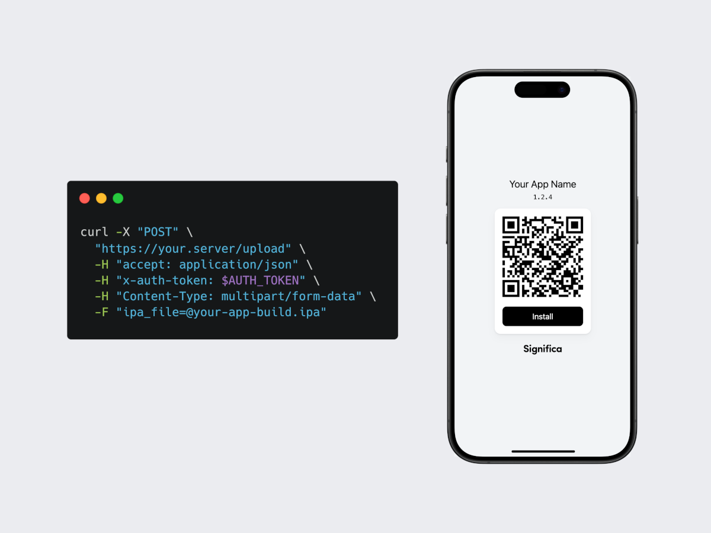

# Simple iOS/Android App Distribution Server

This is a simple, self-hosted iOS/Android app distribution server (ipa and apk files).



This server can be used for either Ad-hoc or Enterprise application distribution.
Developers can perform internal builds on their computers (without using a service like Expo)
and utilize this platform to easily distribute the build among other developers, testers,
or clients.

We wrote a blog post about this project. It explains the 'Why' and provides a 'How-to' style
walkthrough on using and deploying it: [How to distribute iOS IPA builds][blog post].

The project provides a single endpoint for uploading an `.ipa` or `.apk` build. It returns a
publicly accessible, minimalistic installation page with a QR code - that simple. It is designed
for easy deployment within your infrastructure via a Docker container. And the upload functionality
is secured with a pre-shared authorization token (see "Configuration" below).

To maintain simplicity and focus, this project **does not** handle device ID registration or
application building, just sharing files with a simple, public install page.

## Usage

To run with Docker:

```sh
docker run \
  -p 8000:8000 \
  -v ./uploads:/uploads \
  ghcr.io/significa/app-distribution-server
```

To upload your built iOS or Android app, just run:

```
curl -X "POST" \
  "http://localhost:8000/upload" \
  -H "Accept: application/json" \
  -H "X-Auth-Token: secret" \
  -H "Content-Type: multipart/form-data" \
  -F "app_file=@your-app-build.ipa"
```

Where `your-app-build.ipa` is your iOS IPA build or Android APK (ex: `your-app-build.apk`).

This will return a link to the installation page.

More documentation in the Swagger OpenAPI explorer available on `/docs`.

## Upgrading / migration to v2

This project was previously called `ios-ipa-app-distribution-server`, from release 2 on it was
renamed to `app-distribution-server` - as it now supports both IPA and APK files.

Migrating from version `1` to `2` should be straightforward:

- Update the image to `ghcr.io/significa/app-distribution-server`.
- The upload multipart form submission now accepts a field named `app_file` (instead of `ipa_file`).

The uploads directory is backwards compatible, meaning that previously uploaded files (from v1) will
continue to work with the new version. In v2, we've introduced additional fields on the download
page to provide more detailed information about each upload. For most of these fields, we can infer
or migrate the missing data from the older uploads. However, one exception is the creation time,
which was not stored in v1 uploads. As a result, the creation time will not be displayed for files
uploaded prior to v2.

## Configuration

- `UPLOADS_SECRET_AUTH_TOKEN`: Token used to upload builds. **Don't forget to change it!**
  Default: `secret`.

- `APP_BASE_URL`: The front-facing app URL for link generation.
  Defaults to `http://localhost:8000`.

- `STORAGE_URL`: A [PyFilesystem2](https://github.com/PyFilesystem/pyfilesystem2) compatible URL.
  Defaults to `osfs:///uploads` for Docker installations, and `osfs://./uploads` when running
  directly with Python. This means `/uploads` and `./uploads` respectively.  

  Compatible with many storage backends. Check out the possible configurations in the
  [index of filesystems](https://www.pyfilesystem.org/page/index-of-filesystems/).
  
  AWS S3 Example: `s3://your-bucket-name` (and then provide the credentials via the usual
  `AWS_ACCESS_KEY_ID` and `AWS_SECRET_ACCESS_KEY`).

- `LOGO_URL`: The logo URL - absolute URL or a relative path to a logo `src`. Defaults to
  `/static/svg/logo.svg` (Significa's logo). Disable the logo by setting it to `false`
  (`LOGO_URL=false`).

- `APP_TITLE`: Defaults to `iOS/Android app distribution server`, use it to customise your page
  title.

## Development

**Requirements**:

- Python 3.11
- Make tools

**Useful development commands**:

- Setup a virtual environment (ex: `make setup-venv`).

- Install the dependencies: `make install-deps`.

- Start the development server: `make dev`.  
  Open the interactive OpenAPI explorer (Swagger): http://localhost:3000/docs.

- When changes to the dependencies are made, freeze them in the lockfile with: `make lock-deps`.

## License

[GNU GPLv3](./LICENSE)

---

Built by [Significa](https://significa.co)


[Blog post]: https://significa.co/blog/how-to-distribute-ios-ipa-builds

[](https://significa.co/)

